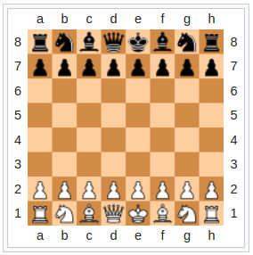
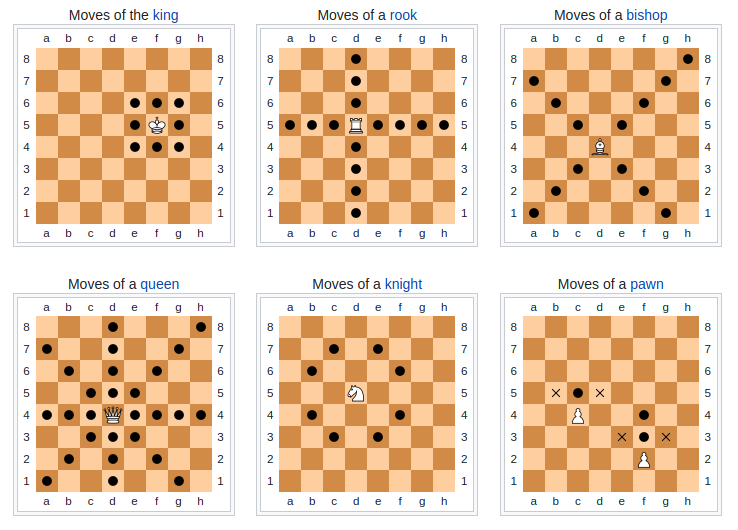
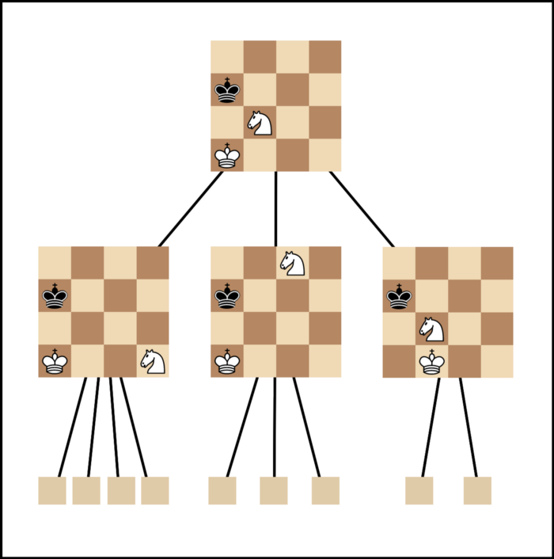
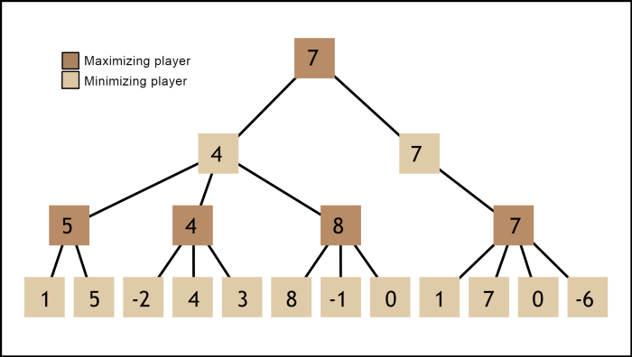
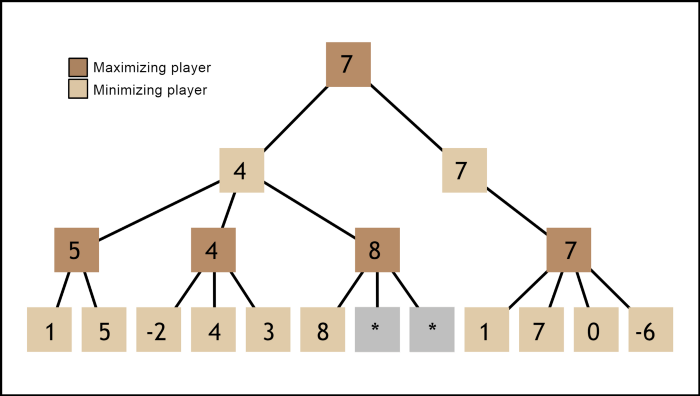

# Chess

Chess is an abstract strategy game. It is played on an $8 \times 8$ grid, with each player controlling sixteen pieces: one king, one queen, two rooks, two knights, two bishops amd eight pawns. The object of the game is to checkmate the opponent's king, whereby the king is under immediate attack and there is no way for it to escape.



The moves of each of the pieces is shown below



We will now explore an algorithm that’s responsible for your computer beating you at chess. 


## Minimax

Lets start of by looking at the moves a computer can make if its starting the game. Each of the 8 pawns have 2 possible moves and the knights have 2 possible moves each giving a total of 20 moves. Similarly the opponent also has 20 possible moves. Thus the computer has to look at $20 \times 20$ scenarios in just two moves. All the possile configurations of the chessboard are approximately $10^{120}$, which is greater than the number of atoms in the visible universe! We model these scenarios in the form of tree and the computer generates this tree to best of its capabilities.



 Chess is zero-sum game, thus maximizing your chances is same as minimizing the opponent’s chances of winning. We now decide upon an evaluation function, this varies from author to author and depends on the many complicated factors such as individual pieces, board position, control of the center, vulnerability of the king to check, vulnerability of the opponent’s queen, etc. We will assume a simple evaluation function that is number of white pieces - number of black pieces. Thus in terms of search tree, the computer choses the children nodes with either the best or worst scores based on the colour played by it.



The above is an example of a minimax search tree. The leaf nodes are assigned scores based on some evaluation function and the higher nodes then decide their scores based on the min or max of their children nodes.


This pseudocode for algorithm is given below

```python
def minimax(node, depth, maximizing player):
    # depth is the maximum depth to which algorithm is applied
    # maximizing player is a boolean of whether the player is maximizing or not
    if depth = 0 or node is terminal node:
        return evaluation(node)
    if maximizing player:
        value = -∞
        for child of node:
            value = max(value, minimax(child, depth - 1, False))
        return value
   	else:
        value = +∞
        for child of node:
            value = min(value, minimax(child, depth-1, True))
        return value
```

The number of scenarios to be evaluated is still high for any computer to check in a reasonable amount of time. We use technique called Alpha Beta pruning to reduce this number.

## Alpha-Beta pruning

In chess, there are moves that allow the other player to get a clear upper hand in the next few turns. A standard minimax evaluates these moves just as much as the others, thus slowing it down.

Alpha-Beta pruning speeds up minimax by skipping the irrelevant nodes of the search tree. We accomplish this by adding an alpha and beta value, which represent the worst outcome for each player from that node.

Since the maximizing player knows that the minimizing player will pick a response that minimizes the evaluation, they also know that they can avoid thinking about moves that allow the minimizing player to make things worse than they already are. These moves are pruned from the search tree and skipped.



Alpha-beta search skips nodes once it knows for certain that they won’t be played. In this example, the minimizing player comes across a position with a score of 8. The maximizing player will either play that position or one with a higher score. Since the minimizing player already found a better move to play (the one with a score of 4), there’s no need to further explore this node.

---

- The algorithm can be further optimised by using move ordering, transposition tables and quiescence search. You can read about these [here](https://medium.com/@SereneBiologist/the-anatomy-of-a-chess-ai-2087d0d565#:~:text=an%20evaluation%20function.-,Minimax%20search,chess%20engine%20compares%20possible%20moves.&text=The%20minimax%20algorithm%20takes%20advantage,the%20opponent's%20chances%20of%20winning.).

- Another approach to the same problem is [AlphaZero](https://en.wikipedia.org/wiki/AlphaZero), which utilises neural networks along with monte-carlo tree search.
- This [link](https://www.freecodecamp.org/news/simple-chess-ai-step-by-step-1d55a9266977/) includes a good board evaluation function along with other ways to improve our algorithm.
