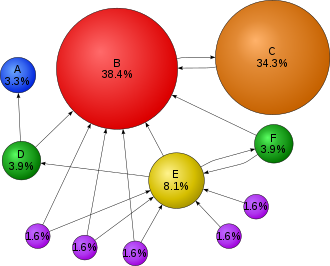
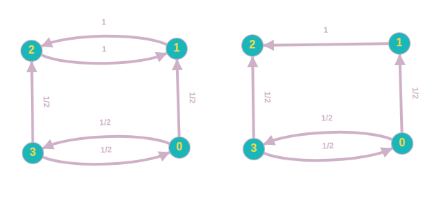

# How does a Search Engine work ?

A **Search engine** is a software system that is designed to search the World wide web in a systematic way for a particular query. Search engines also maintain real-time information by running an algorithm on a web crawler. A crawler is program that browses the World Wide web for web indexing.

We will look at the algorithm behind Google, the most popular search engine.

## PageRank

Google's keyword search function is similar to other search engines. Automated programs called **spiders** or **crawlers** travel the Web, moving from link to link and building up an index page that includes certain keywords. Google references this index when a user enters a search query. The search engine lists the pages that contain the same keywords that were in the user's search terms. Google's spiders may also have some more advanced functions, such as being able to determine the difference between Web pages with actual content and redirect sites -- pages that exist only to redirect traffic to a different Web page.

**PageRank** is the algorithm used by Google search to rank web pages in their search engine. It isn’t the only algorithm used by Google, but it was the first algorithm used by it and is the best known one. PageRank is a link analysis algorithm where it assigns a numerical weight to each element of a hyperlinked set of documents on the World Wide Web. It results from a mathematical algorithm based on the graph created with all the web pages as nodes and the hyperlinks as edges. 

PageRank represents the probability of a surfer to reach web page. Thus a PageRank of 0.5 implies that a person has a 0.5 probability of reaching that web page.

Initially PageRank is initialized to the same value for all pages, such that the sum of PageRanks is equal to 1. In each iteration of the algorithm, the web page gains PageRank from the web pages linking to it. Let $r_i$ denote the page rank of $ith$ web page. The PageRank of the $jth$ web page in the next iteration is given by
$$
r_j = \sum_{i \rightarrow j}\frac{r_i}{d_i}
$$
where, $d_i$ is the out-degree of the $ith$ node.

### Damping factor

A person who is randomly clicking on links will eventually stop clicking, to account for this, a damping factor $d$ is introduced. It is generally assumed that the damping factor will be set around 0.85. The formula for the PageRank of the $jth$ web page is given by
$$
r_j = \frac{1-d}{N}+d(\sum_{i\rightarrow j}\frac{r_i}{d_i})
$$
Google recalculates the PageRank scores each time it crawls the Web and rebuilds its index. As Google increases  the number of documents in its collection, the initial approximation of PageRank decreases for all documents.

If a page has no links to other pages, it becomes a sink and therefore terminates the random surfing process. If the random surfer arrives at a sink page, it picks another web page at random and continues surfing again. The same is done in case the surfer is stuck between two nodes.

In the first figure, if the surfer reaches node 1 or 2, he can only move between those two. This is known as a spider trap. In the second figure if the surfer reaches 2, it has no where to go.

## Computation of PageRank

The PageRank values are the entries of the dominant right eigenvector of the modified adjacency matrix rescaled so that each column adds up to one. Let $R$ denote the eigenvector the $R$ is given by
$$
R = \begin{bmatrix}r_1\\r_2\\.\\.\\r_n\end{bmatrix}
$$
We do this computation iteratively as follows

1. Initialize $r_i=\frac1N$

​		where, $N$ is the total number of pages.

2.  In each iteration compute
   $$
   R_{t+1} = dMR_t+\frac{1-d}N1
   $$
   where $R_t$ is the value of the eigenvector in the $t^{th}$ iteration, $1$ is the column vector of length $N$ consisting of only ones.
   The matrix $M$ is defined as
   $$
   M_{ij} = \begin{cases}\frac1{L(p_j)},&\text{if j links to i}\\
   0,&\text{otherwise}\end{cases}
   $$

3. The probability calculation is concluded if $|R_{t+1} - R_t| < \epsilon$ for some small $\epsilon$, that is when convergence is assumed.