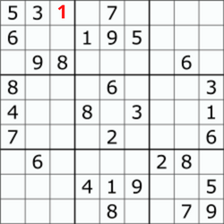
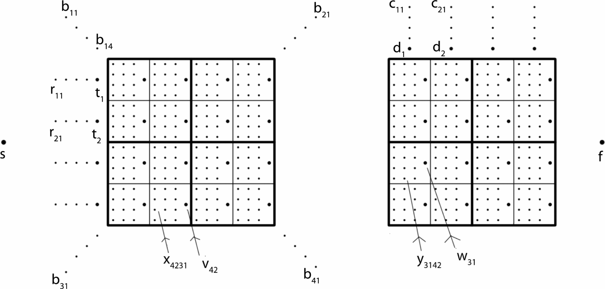

# Sudoku

*Sudoku* is a logic based, combinatorial number placement puzzle. Given a partially completed $9 \times 9$ grid of numbers from 1 to 9 we fill all the remaining boxes with digits from 1 to 9 such that every row, column, diagonal and each of the nine $3 \times 3$  grids contain all the digits from 1 to 9.

|                        Sudoku puzzle                         |                           Solution                           |
| :----------------------------------------------------------: | :----------------------------------------------------------: |
|  |  |

A naive approach to solving this problem is to generate all possible configurations by placing numbers from 1 to 9 in the empty cells. This would result in a total of $9^e$ configurations, where $e$ is the number of empty cells in the puzzle, whose validity can checked in constant time. This gives us the time complexity of this algorithm as $O(9^e)$.

We will now explore an algorithm that can solve the same puzzle faster than our naive approach.

## Backtracking

*Backtracking* is an algorithm that incrementally builds candidates to the solutions and abandons a candidate as soon as it determines that the candidate cannot possibly lead to a valid solution. When the algorithm abandons a candidate, it typically returns to a previous stage in the problem solving process. *Backtracking* is often much faster than the brute force solutions for a problem since it can eliminate multiple candidates with a single test.

The algorithm to solve Sudoku with backtracking is as follows

1. Assign a number to an empty cell such that it can be part of the solution, that is it doesn’t violate any constraints of the puzzle.
2. Recursively check whether the above assignment leads to valid solution or not. If the above assignment fails we try the next number. If none of the numbers 1 to 9 lead to solution, we can conclude that puzzle has no solution.

The above algorithm is applied as follows for the puzzle above

1. Assign a number to any cell without violating constraints

   

2. Apply the same algorithm to see find solution for the puzzle above. The puzzle doesn’t have a valid solution when there is a cell in which inserting any digit violates the constraints, In which case change the number in step 1 repeat the steps.

A visualization of this code can be found [here](https://trinket.io/python/ae539dcb34).

## The generalized Sudoku problem

The generalized Sudoku problem is the generalized version of the problem discussed above where the total number of symbols are $N$ instead of 9 in the above version. The square is also scaled to the size $N \times N$ and to retain the blocks we choose $N$ such that it is a perfect square. We find that this problem is NP complete and is equivalent to the Hamiltonian cycle problem.

The Hamiltonian cycle problem is defined as, For a simple graph $G$ containing vertex set $V$ and the edge set $E$ determine whether there exists a path such that each vertex is visited exactly once. This problem is shown to NP complete thus by proving the equivalence of the generalized Sudoku problem and Hamiltonian cycle problem we prove that the generalized cycle problem is NP complete.

### Conversion of generalized Sudoku to Hamiltonian cycle 

**Idea** : We encode every possible variable choice in Sudoku to a subgraph. Traversing the subgraph in a certain way will correspond to particular choice for that variable. Then we link the subgraphs such that they can only be consecutively traversed in none of the constraints are violated.

In the final instance of Hamiltonian cycle problem that is produced, the vertex set $V$ will comprise of the following, where $a, i, j$ and $k$ all take values from $1$ to $N$:

- A single starting vertex $s$ and finishing vertex $f$.
- Block vertices: $N^2$ vertices $b_{ak}$, corresponding to number $k$ in block $a$.
- Row vertices: $N^2$ vertices $r_{ik}$, corresponding to number $k$ in row $i$.
- End Row vertices: $N$ vertices $t_i$ corresponding to row $i$.
- Column vertices: $N^2$ vertices $c_{jk}$ corresponding to number $k$ in column $j$.
- End Column vertices: $N$ vertices $d_j$ corresponding to column $j$.
- Puzzle vertices: $3N^3$ vertices $x_{ijkl}$ corresponding to number $k$ in position $(i,j)$, for $l=1,2,3$.
- End Puzzle vertices: $N^2$ vertices $v_{ij}$ corresponding to position $(i,j)$.
- Duplicate Puzzle vertices: $3N^3$ vertices $y_{ijkl}$ corresponding to number $k$ in position $(i,j)$, for $l=1,2,3$.
- End Duplicate Puzzle vertices: $N_2$ vertices $w_{ij}$ corresponding to position $(i,j)$.

Let us see this conversion for $N = 4$. 

Only a few vertices have been labeled to aid in understanding where the vertices lie. The individual vertices on the left and right $s$ and $f$ respectively. The Sudoku puzzle is duplicated as it is only convenient to satisfy two constraints at a time. Hence the vertices in the first puzzle will be linked together in such a way as to ensure the block constraints, and the row constraints, are simultaneously satisfied. Then, the vertices in the second puzzle will be linked together in such a way to ensure the solution in the second puzzle is a duplicate of the first, and the column constraints are also satisfied.

The graph will be linked together such that any valid situation to the Sudoku puzzle will correspond to a Hamiltonian cycle in the following manner:

1. The starting vertex $s$ is visited first.
2. For each $a$ and $k$, suppose number $k$ is placed in position $(i,j)$ in block $a$. Then, vertex $b_{ak}$ is visited, followed by all $x_{ijml}$ for $m≠k$, followed by all $y_{ijml}$ for $m≠k$. This process will ensure that each of the $N$ blocks contain each number from $1$ to $N$.
3. For each $i$ and $k$, suppose number $k$ is placed in position $(i,j)$ in row $i$. Then, vertex $r_{ik}$ is visited, followed by $x_{ijk3}, x_{ijk2}, x_{ijk1}$ and then $v_{ij}$. If $k=N$ then this is followed by $t_i$. This process will ensure that each of the $N$ rows contain each number from $1$ to $N$.
4. For each $j$ and $k$, suppose number $k$ is placed in position $(i,j)$ in column $j$. Then, vertex $c_{jk}$ is visited, followed by $y_{ijk3}, y_{ijk2}, y_{ijk1}$ and then $w_{ij}$. If $k=N$ then this is followed by $d_j$. This process will ensure that each of the $N$ columns contain each number from $1$ to $N$.
5. The finishing vertex $f$ is visited last and the Hamiltonian cycle returns to $s$.

The idea was to create two identical copies of the puzzle, in step 2 we place numbers in the puzzle to ensure numbers are placed identically in both the copies. Placing a number $k$ into position $(i,j)$, contained in block $a$, is achieved by first visiting $b_{ak}$, and then proceeding to visit every puzzle vertex $x_{ijml}$ except for when $m=k$, effectively leaving the assigned number open, or unvisited.

---

The complete proof of this equivalence can be found [here](https://www.sciencedirect.com/science/article/pii/S097286001630038X#:~:text=The%20generalised%20Sudoku%20problem%20is,Sudoku%20also%20demands%20block%20constraints.)
