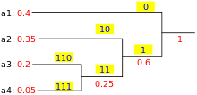

# How do Zip files work ?

**ZIP** is an archive file format that supports lossless data compression. A zip file may contain one or more directories that may have been compressed. The ZIP format permits a number of compression algorithms.

We will look into the **DEFLATE** algorithm, the most common algorithm for compressing a zip file. It is in fact a combination of two algorithms **Huffman encoding** and **LZ77**.

## Huffman encoding

We create a binary tree with each of the leaf nodes containing a symbol and the weight of the symbol. The process begins with the leaf nodes containing the probabilities of the symbol they represent. Then, the process takes the two nodes with smallest probability, and creates a new internal node having these two nodes as children. The weight of the new node is set to the sum of the weight of the children. We then apply the process again, on the new internal node and on the remaining nodes (i.e., we exclude the two leaf nodes), we repeat this process until only one node remains, which is the root of the Huffman tree.



This way we get the shortest possible encoding for given input. The data used to generate the tree must also be encoded for the decoder to decode the transmission.

## LZ77

LZ77 is sometimes also known as *sliding window compression*. It achieves compression by replacing repeated occurrences of  data with references to a single copy of that data existing earlier in the uncompressed data stream. A match is encoded by a pair of numbers called a length-distance pair, which is equivalent to the statement “each of the next length characters is equal to the character exactly distance character behind it in the uncompressed stream.”. The representation used in deflate format limits distances to 32K bytes and lengths to 258 bytes.

The pseudocode for this algorithm is given by

```python
while input is not empty do
    prefix := longest prefix of input that begins in window
    if prefix exists then
        d := distance to start of prefix
        l := length of prefix
        c := char following prefix in input
    else
        d := 0
        l := 0
        c := first char of input
    end if
    output (d, l, c)
    discard l + 1 chars from front of window
    s := pop l + 1 chars from front of input
    append s to back of window
repeat
```

This is the most computationally expensive part of the DEFLATE algorithm. Each block of data is compressed using LZ77 and then compressed using Huffman encoding. Each block of the output stream is then preceded by a 3-bit header providing necessary information for decompression.

- First bit: Last-block-in-stream marker:
  - `1`: This is the last block in the stream.
  - `0`: There are more blocks to process after this one.
- Second and third bits: Encoding method used for this block type:
  - `00`: A stored  section, between 0 and 65,535 bytes in length
  - `01`: A *static Huffman* compressed block, using a pre-agreed Huffman tree defined in the RFC
  - `10`: A compressed block complete with the Huffman table supplied
  - `11`: Reserved—don't use.

Most of the compressible data ends up being encoded using method `01`, which produces an optimized Huffman tree. Instructions to generate the necessary Huffman tree immediately follow the block header. The static Huffman option is used for short messages, where the fixed saving gained by omitting the tree outweighs the percentage compression loss due to using a non-optimal code.

## Decoding

Knowing the encoding and the output format of the DEFLATE algorithm, decoding is pretty straight forward. The pseudocode for decoding is given by

```bash
do
   read block header from input stream.
   if stored with no compression
      skip any remaining bits in current partially
         processed byte
      read LEN and NLEN (see next section)
      copy LEN bytes of data to output
   otherwise
      if compressed with dynamic Huffman codes
         read representation of code trees (see
            subsection below)
      loop (until end of block code recognized)
         decode literal/length value from input stream
         if value < 256
            copy value (literal byte) to output stream
         otherwise
            if value = end of block (256)
               break from loop
            otherwise (value = 257..285)
               decode distance from input stream
               move backwards distance bytes in the output
               stream, and copy length bytes from this
               position to the output stream.
      end loop
while not last block
```